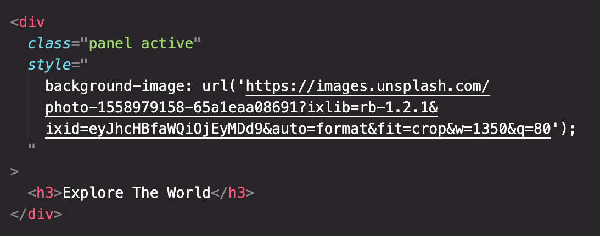
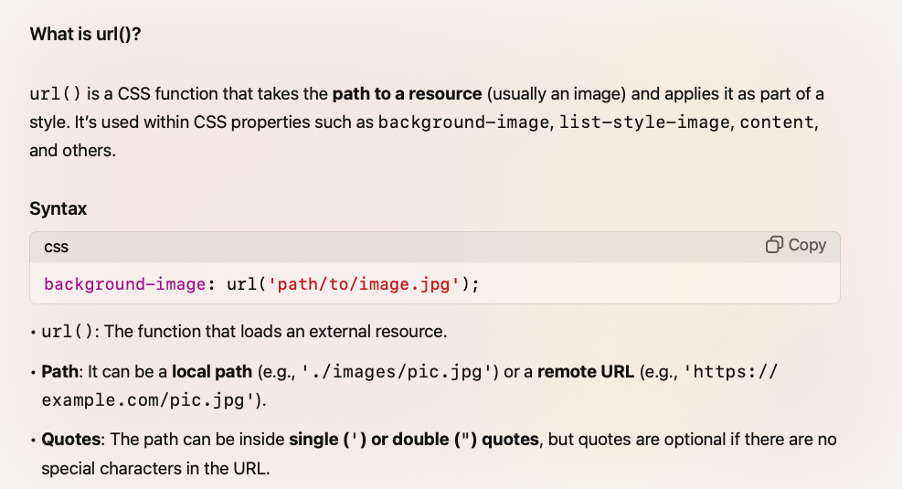

# How to include the font awesome into the project:

- Visit the website and register. A kit code will either be sent via email, or you can scroll through the website to find the `Font Awesome script tag`.
- Or visit the `cdnjs.com` and search for font awesome

# Expanding Cards

- we have a `container` class wrapping the 5 div of class `panel` and `active`
- Using the class `active` we are going to tell which card to expand

  

- style Attribute:
  - The style attribute allows inline CSS to be applied directly to this element.
  - background-image: applies a background image to the 
 using the url() function.

  

---

## JS Code:

- classList is a property in JavaScript that helps you add, remove, or manage CSS classes on an element.
